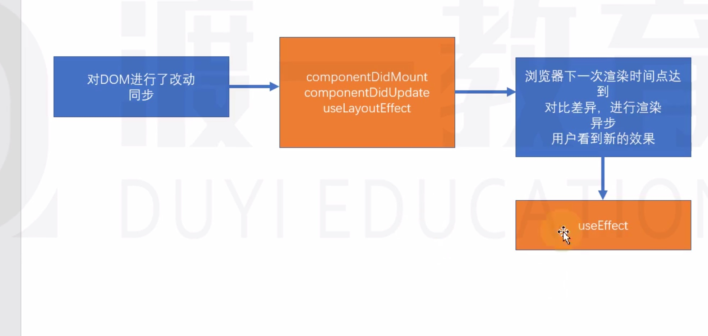
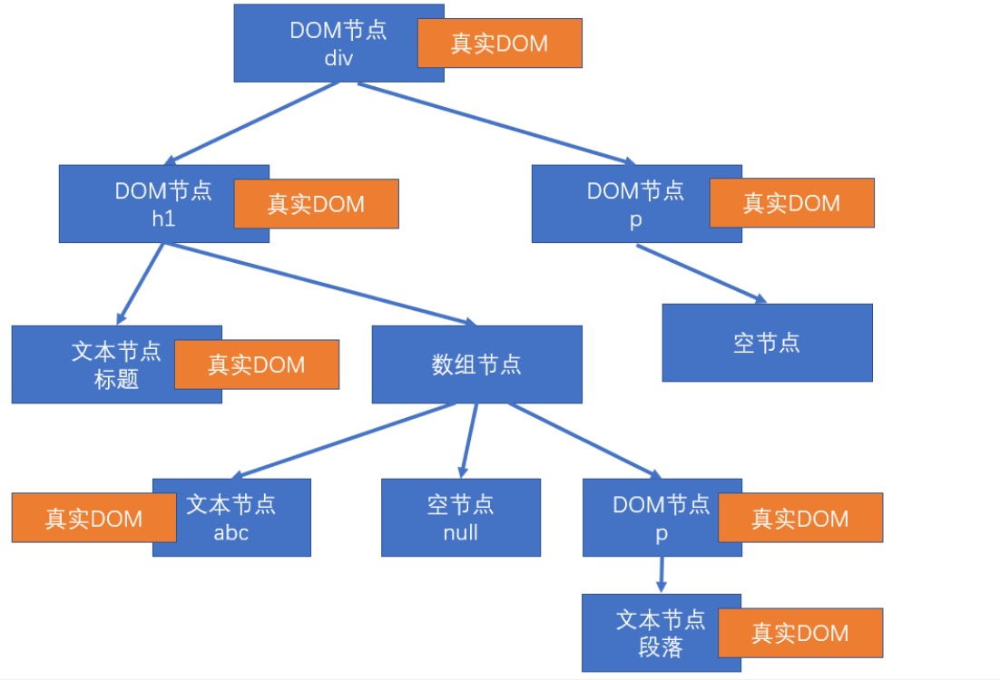
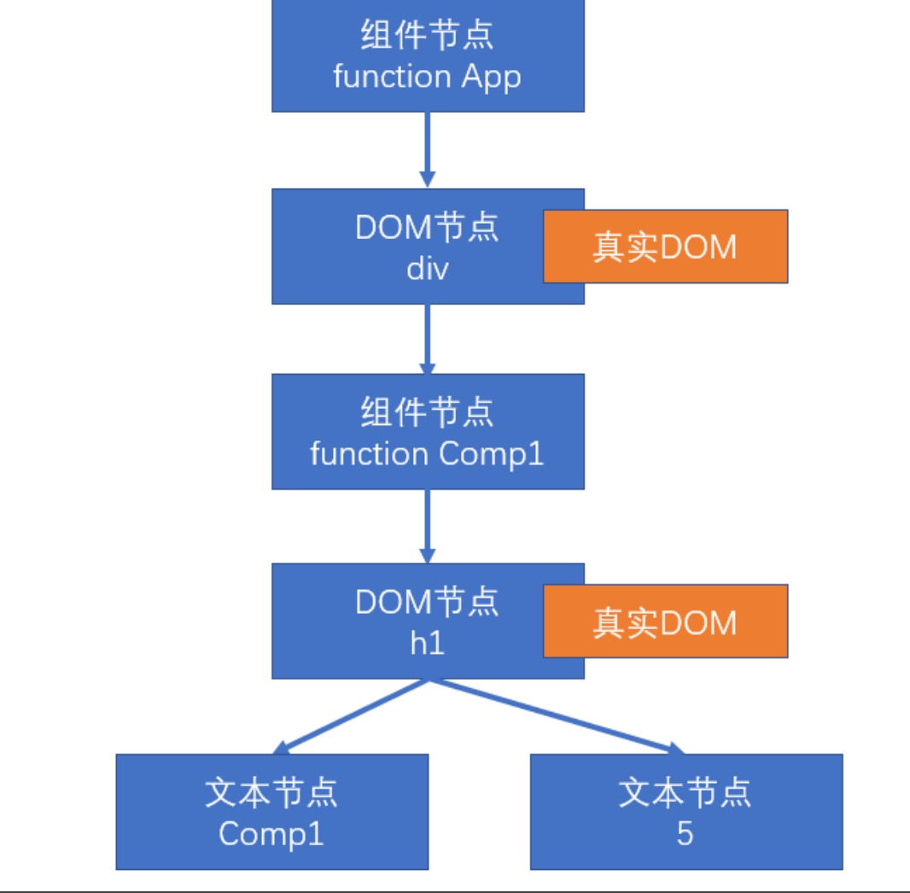
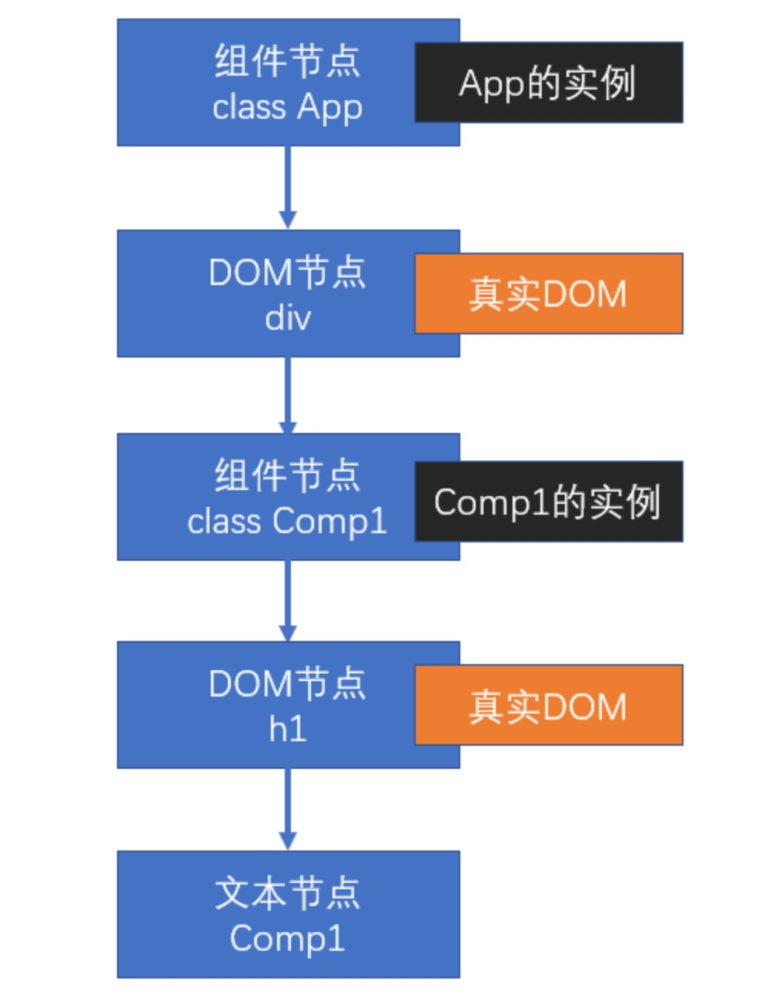

#渲染原理

渲染：生成用于显示的对象，以及将这些对象形成真实的DOM对象

React元素：通过React.createElement创建(语法糖：JSX)
    例如`<div><h1></h1></div>`     `<App/>`
React节点：专门用于渲染到UI界面的对象，React通过React元素，创建React节点。ReactDom一定是通过React节点来进行渲染的
    节点类型：
        (1)React Dom节点：创建该节点的React元素类型是一个字符串`<div><h1></h1></div>`
        (2)React 组件节点：创建该节点的React元素类型是一个函数或者类
        (3)React 文本节点：由字符串/数字 创建的
        (4)React空节点：由null/undefined/false/true
        (5)React数组节点：由数组创建
React节点不一定全部是由React元素创建，还有字符串/null/undefined/false/数组
真实DOM：通过document.createElement创建


##首次渲染（新节点渲染）
1。通过参数的值创建节点
2。根据不同的节点做不同的事情
    (1)文本节点：通过document.createTextNode创建真实的文本节点
    (2)空节点：什么都不做
    (3)数组节点：遍历数组，将数组每一项递归创建节点(回到第一步进行返回操作，直到遍历结束)
    (4)DOM节点：通过document.createElement创建真实的DOM对象，然后立即设置该真实DOM元素的各种属性，然后遍历对应React元素的children属性，递归操作（回到第一步进行返回操作，直到遍历结束）
    (5)组件节点
        1/函数组件：调用函数（该函数必须 返回一个可以生成节点的内容），将该函数的返回结果递归生成节点（回到第一步进行反复操作，直到遍历结束）
        2/类组件：
            1. 创建该类的实例
            2. 立即调用对象的生命周期方法：static getDerivedStateFromProps
            3. 运行该对象的render方法，拿到节点对象（将该节点递归操作，回到第1步进行反复操作）
            4. 将该组件的componentDidMount加入到执行队列（先进先出，先进先执行），当整个虚拟DOM树全部构建完毕，并且将真实的DOM对象加入到容器中后，执行该队列
3.生成出虚拟DOM树之后，将该树保存起来，以便后续使用。如果之后发生变化进行对比来更新
4.将之前生成的真实DOM对象，加入到容器中
````
const Abc = <div className="assaf">
    <h1>
        标题
        {["abc", null, <p>段落</p>]}
    </h1>
    <p>
        {undefined}
    </p>
</div>;
ReactDOM.render(
    Abc,
    document.getElementById('root'))
````
以上代码生成的虚拟DOM树：


###函数组件
```js

function Comp1(props) {
    return <h1>Comp1 {props.n}</h1>
}

function App(props) {
    return (
        <div>
            <Comp1 n={5} />
        </div>
    )
}

const app = <App />;
ReactDOM.render(app, document.getElementById('root'));
```

以上代码生成的虚拟DOM树：


###类组件

```js
class Comp1 extends React.Component {
    render() {
        return (
            <h1>Comp1</h1>
        )
    }
}

class App extends React.Component {
    render() {
        return (
            <div>
                <Comp1 />
            </div>
        )
    }
}

const app = <App />;
ReactDOM.render(app, document.getElementById('root'));
```

以上代码生成的虚拟DOM树：


##更新节点
更新的场景：
1。重新调用ReactDom.render,完全重新生成节点树,触发根节点更新
2。在类组件的实例对象中调用setState,会导致该实例所在的节点更新

**节点的更新**
如果调用的是ReactDom.render，进入根节点(diff)更新
如果调用的是state
1.运行生命周期函数，getDerivedStateFromProps
2。运行生命周期函数shouldComponentUpdate，如果该函数返回FALSE,终止当前流程
3。运行render，得到新的节点，进入该新节点的**对比更新** 
4。将生命周期函数getSnapshotBeforeUpdate加入执行队列，以待将来执行
5。将生命周期函数componentDidUpdate加入执行队列，以待将来执行


**对比更新**
将新产生的节点，对比之前虚拟DOM中的节点，发现差异，产生更新

问题：对比之前DOM树中的哪个节点

React为了提高对比效率作出以下假设：
1。假设节点不会出现层级的移动（对比时，直接找到旧树中对应位置的节点进行对比）
2。不同的节点类型会生成不同的结构
    1。相同的节点类型，节点本身类型相同，如果是组件节点，组件类型也必须相同。如果由React元素生成，type值还必须一致
    2。其他的，都属于不相同的节点类型
3。多个兄弟通过唯一标识(key)来确定对比的新节点(确定渲染目标  )
    key值作用：用于通过旧节点，寻找对应的新节点，如果某个旧节点有Key值，则其更新时，会寻找相同层次中相同key值的节点，进行对比

####找到了对比的目标
(1)一致：
根据不同的节点做不同的事情
空节点：不做任何事情
DOM节点：
    1.直接重用之前真实DOM对象 
    2.将其属性变化记录下来，以待将来统一完成更新（现在不会真正变化）
    3.遍历该新的React元素的子元素，**递归对比更新**
文本节点：
    1.直接重用之前的真实Dom对象
    2。将新的文本变化记录下来，将来统一完成更新 
函数节点：重新调用函数，得到一个节点对象，进入**递归对比更新**
类组件：
    1.重用之前的实例
    2.运行生命周期函数，getDerivedStateFromProps
    3。运行生命周期函数shouldComponentUpdate，如果该函数返回FALSE,终止当前流程
    4。运行render，得到新的节点，进入该新节点**递归对比更新**
    5。将生命周期函数getSnapshotBeforeUpdate加入执行队列，以待将来执行
    6。将生命周期函数componentDidUpdate加入执行队列，以待将来执行
数组节点：遍历数组进行**递归对比更新**

(2)不一致：
整体上，卸载旧的节点，创建全新的节点
**创建新节点**
进入新节点的挂载流程（首次渲染（新节点渲染））
**卸载旧节点**
1。**文本节点/Dom节点/数组节点/空节点/函数组件节点**：直接放弃该节点，如果该节点有子节点，递归卸载子节点
2.**类组件节点**
    1。直接放弃该节点
    2。调用该节点的componentWillUnMount
    3。递归卸载子节点


####没有找到对比目标
新的DOM树中有节点被删除；新的DOM树中有节点添加
创建新加入的节点，删除多余的旧节点

##后续步骤： 
0。更新虚拟Dom树
1。完成真实的DOM更新
2。依次执行队列中的componentDidMount
2。依次执行队列中的getSnapshotBeforeUpdate
3。依次执行队列中的componentDidUpdate 

