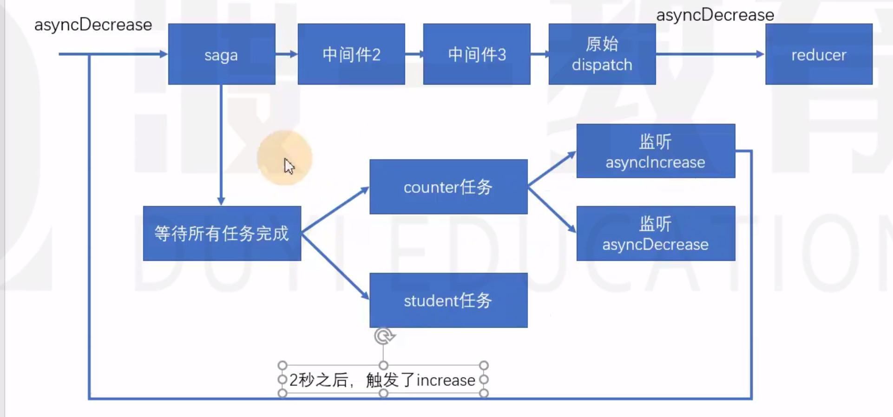

# redux-saga

中文文档地址：https://redux-saga-in-chinese.js.org/
- 纯净（处理副作用纯净）
- 强大
- 灵活

安装 yarn add redux-saga

在saga任务中，(1)如果yield了一个普通数据，saga不做任何处理，仅仅将数据传递给yield表达式（把得到的数据放到next的参数中）,因此，在saga中，yield一个普通数据没意义。(2)当saga发现得到的结果是一个Promise对象，它会自动等待该promise对象完成.完成后，会把得到的结果作为值传递给下一次next。如果promise对象被拒绝，saga会使用generator.throw跑出一个错误。studentTask copy.js

saga需要在yield后面放上一些合适的saga指令（saga effect）,如果放的是指令，saga中间件会根据不同的指令进行特殊处理，以控制整个任务流程。

每个指令本质上是一个函数，该函数调用后，会返回一个指令对象，saga会接受到该指令对象，进行处理
**一旦saga任务完成（生成器函数运行完成）则saga中间件一定结束，因此使用while(true)一直循环,不让任务结束**
**指令前面必须加yield,以确保该该指令的返回结果被saga控制**
- take指令：【阻塞】监听某个action,如果action发生了，则会进行下一步处理，take指令仅监听一次，yield得到的是完整的action对象
- all指令：【阻塞】该函数传入一个数组，数组中放入生成器，saga会等待所有的生成器全部完成后才会进一步处理，counterTask()生成器里面while(true)一直循环，所以不会结束，要把while(true)去掉
- takeEvery指令：【不阻塞】不断的监听某个action,当某个action到达之后，运行一个函数。takeEvery永远不会结束当前当生成器
- delay指令：【阻塞】阻塞指定的毫秒数

- put指令：【不阻塞】用于重新触发action,相当于dispatch一个action.
saga监听到asyncIncrease的action之后，隔了2s，触发increase的action，重新分发，从头开始，由于saga中间件监控不到increase，继续往下分发。saga中间件不会拦截分发。在thunk中，若action是一个带有副作用的函数，被分发时，thunk会阻止action向后移交。counterTask.js
- call指令：【可能阻塞，如果是promise肯定要阻塞】用于副作用(通常是异步)函数调用.和apply用处一样，但call更常用
- apply指令：【可能阻塞，如果是promise肯定要阻塞】用于副作用(通常是异步)函数调用
- select指令:用于得到当前仓库中的数据
- cps指令:【可能阻塞,不常用】用于调用那些传统的回调方式的异步函数
其中重要的有：put call ,apply,take,takeEvery指令