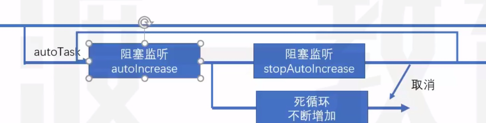

#Redux 核心概念

React          ui解决方案
React-Router   路由解决方案
Redux          数据解决方案
Antd           UI库


action + reducer + store

##MVC
它是一个UI的解决方案，用于降低UI，以及关联的数据的复杂度。

**传统服务端的MVC**

环境：
1。服务端需要响应一个完整的HTML
2。该HTML中包含页面需要的数据
3。浏览器仅承担渲染页面的作用。

以上方式，叫做**服务端渲染**，即服务端将完整的页面组装之后，一起发送给客户端
服务端渲染需要处理UI中要用到的数据，并且将数据嵌入到页面中，最终生成一个完成的HTML响应

为了降低后端这个过程的复杂度，出现了MVC模式、
**服务端的MVC**

Controller:处理请求，组装这次请求需要的数据
Model:处理数据，需要用于UI渲染的数据模型
View：生成页面，视图，用于将模型组装到界面中


现在前端请求URL只会返回一个最基础的HTML结构，附带JS引用

**前端MVC模式的困难**
React解决了  数据 ==》视图 的问题

1。前端的controller要比服务器复杂很多。因为前端中的controller处理的是用户的操作，而用户的操作场景是复杂的。
2。相对于那些组件化的框架（比如，React Vue）,他们使用的是单向数据流。若要共享数据，则必须要将数据提升到顶层组件，然后再将数据一层层传递，极其复杂。
   虽然可以使用上下文来提供共享数据，但对数据的操作难以控制，容易导致调试错误的困呐，以及数据还原的困难。并且，若开发一个大中型项目，共享数据很多，会导致上下文中的数据变得狠复杂。


##前端需要一个独立数据解决方案
解决前端数据的复杂度

**Flux**

Facebook提出的数据解决方案，它的最大历史意义，在于它引入了action的概念

action是一个普通的对象，用于描述要干什么。**action是触发数据变化的唯一原因**

store表示数据仓库，用于存储共享数据。还可以根据不同的action更改仓库中的数据

示例：

```js
var loginAction = {
    type: "login",
    payload: {
        loginId:"admin",
        loginPwd:"123123"
    }
}

var deleteAction = {
    type: "delete",
    payload: 1  // 用户id为1
}
```

**Redux**

在Flux基础上，引入了reducer的概念

reducer：处理器，用于根据action来处理数据，处理后的数据会被仓库重新保存。


