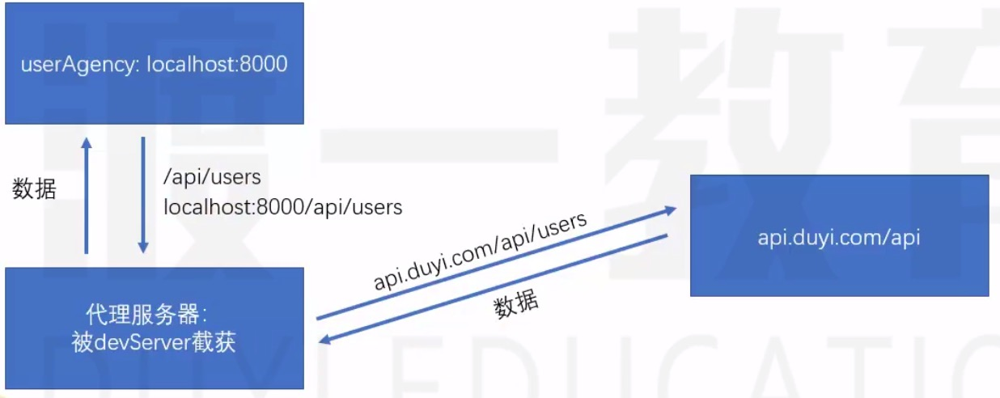
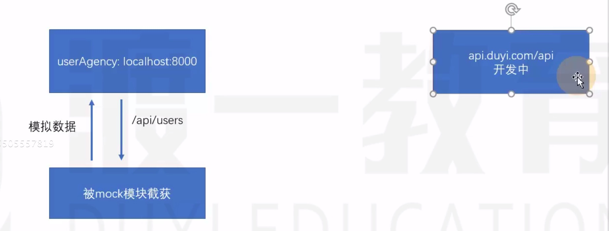

# 代理和数据模拟

## 代理

后台数据处理完成，使用代理
代理用于解决跨域问题

配置```.umirc.js```中的proxy，配置方式和devServer中的proxy配置相同

## 数据模拟
后台数据没有处理完成，使用模拟数据

用于解决前后端协同开发的问题

数据模拟可以让前端开发者在开发时，无视后端接口是否真正完成，因为使用的是模拟的数据

umijs约定：

1. mock文件夹中的文件
2. src/pages文件夹中的_mock.js文件

以上两种JS文件，均会被umijs读取，并作为数据模拟的配置
可以自行发挥，添加模拟数据，通常，我们会和mockjs配合。
yarn add  mockjs

如果不想使用mock数据，直接将mock改个名字，就不会被识别到